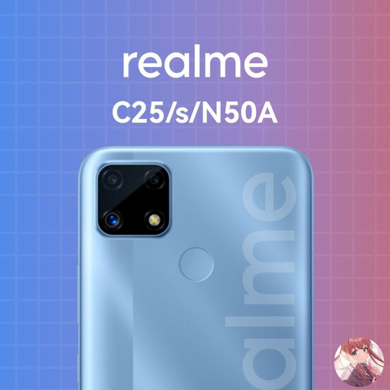

## Android Device Tree for realme C25, C25s & Narzo 50A (even)

The realme C25, realme C25s, and Narzo 50A are budget smartphones from realme, released in 2021. This repository contains the device-specific configuration needed to build LineageOS and based custom ROMs.

*Image Credit: [@Rem01Gaming](https://github.com/Rem01Gaming)*

---

## 📱 Device Specifications

| Feature | Specification |
| :--- | :--- |
| **SoC (C25)** | MediaTek Helio G70 (12 nm) |
| **SoC (C25s & N50A)**| MediaTek Helio G85 (12 nm) |
| **CPU** | Octa-core (2x2.0 GHz Cortex-A75 & 6x1.8/1.7 GHz Cortex-A55) |
| **GPU** | Mali-G52 MC2 |
| **Memory** | 4 GB RAM |
| **Storage** | 64 GB / 128 GB (eMMC 5.1) |
| **MicroSD** | Dedicated slot (up to 512 GB) |
| **Battery** | Li-Po 6000 mAh, non-removable |
| **Dimensions** | 164.4 x 75 x 9 mm (6.47 x 2.95 x 0.35 in) |
| **Display** | 6.5" IPS LCD, 720 x 1600 pixels, 20:9 ratio (~270 ppi) |
| **Rear Camera** | 48MP (Global) / 13MP (India) / 50MP (N50A) + 2MP Depth + 2MP Macro |
| **Front Camera** | 8 MP |
| **Release OS** | Android 11, realme UI 2.0 (Upgradable to Android 12 & 13) |
---

